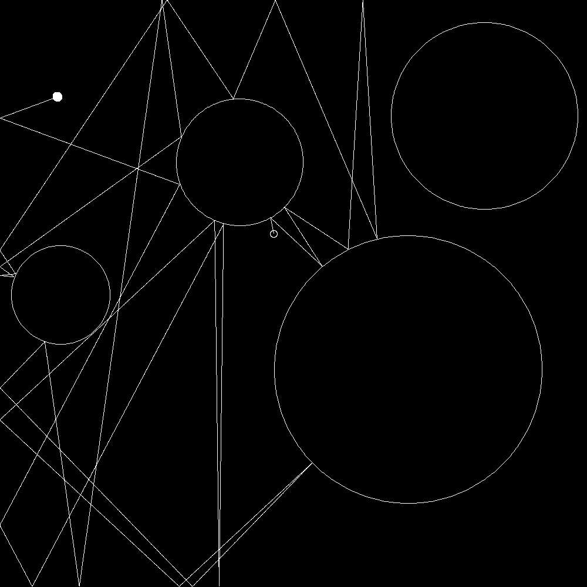

# Billard Dynamics

Makes a random PNG of some circular obstacles and a ball that rolls off into space, obeying the laws of conservation of energy and Mr. Newton.
Changes every time!

cmd: py ball.py

White - Start
Black - End

